# C# - .NET 5 - ASP.NET - API note

NhanNguyen

some little note by myself to remind what did i learn

---

## Things worth to review:

| No. | Content                                   |
| --- | ----------------------------------------- |
|     |                                           |
| 1   | [Overview - Basic](#section-01-the-basic) |
|     | [Namespace](#namespace)                   |
| 2   | [Class](#class)                           |
| 3   | [Unit Test](#unit-test)                   |
| 10   | [Error Handling](#error-handling)                   |

# Section 01 - THE BASIC

We write `C#` in IDE and under the hood when we run `dotnet run`, `C# Compiler (.NET (SDK))` will compile our code to binary code which called `assembly` is contained in `dll file (Dynamic Link Library)`

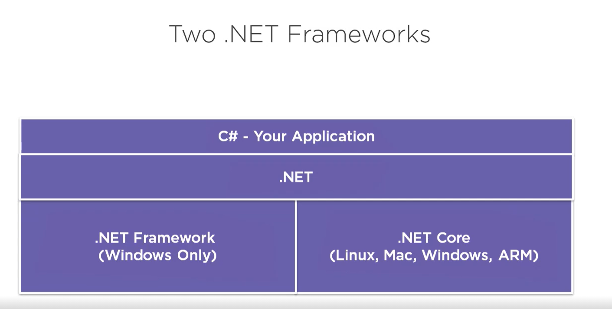

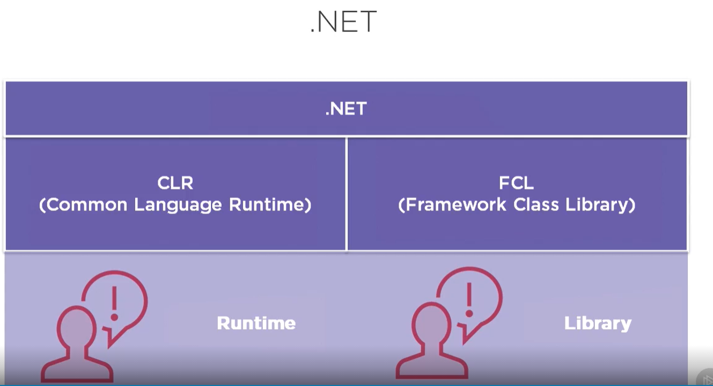

## Namespace

`Namespace` is where we declare our `class` and `method` of class.

It create it own scope and prevent `name conflict` of `class` inside our project and in other library

    `List<>() class` is created in System.Collections.Generic Namespace
    `Console.WriteLine()` is created in System Namespace`

### Best practice: There are should only one class in one file

## Class

Section 4

Class is a blueprint - it contain our property and method.

When we use `new keyword` and `() operator`. C# implicitly call `Constructor()` method.

### Why we you class?

1. Because we want to `encapsulate` and `abstract` our `class`, so that when `other developer` or `us` in the future can `understand quickly` what we are doing

2. Because we want to provide some abstraction and some encapsulation to hide the complexity of this class
   => Easy to maintaining and readable

**Encapsulation:**: is hiding complexities and hiding details that are unimportant at a high level of view

### Static - Public - Private

**Public**: mean that, if we want to use this public property or method inside a class. We have to instantiate an instance of this class

**Private**: mean that this private property or method only accessible inside this class

**Static**: mean that we only have access to this static property or method through this class, not through the instances object of this class

    WriteLine method in Console class of System namespace is static

**Internal**: mean that this class can only be used in the same project

---

---

# Unit Test

Unit test is do the testing for unit part of our code

We use `Xunit` to do the unit test

There are 3 section of unit test

- `Arrange`: Where we put all our test data and we arrange value we going to use

- `Act`: Where we perform calculation to perform actual result

- `Assert`: Where we assert something about the Actual value in Act

# Reference And Value Type

## Variable and Value Type

Variable only can hold value

## Reference Type

Meaning the variable hold a value address that reference to where the instances object (create by class) stay inside the memory.

## Value Type

Meaning variable actual hold the value sit in memory

## Pass by value

In `C#` and `JavaScript` we pass parameter into method by value

=> It mean when we pass object variable as parameter => We pass the address value of that variable for the parameter
=> Both variable and passed parameter hold the same address that point to the same Object Value stay in the memory

## Pass by reference

It mean we pass the reference of the variable to parameter => The parameter is reference to that variable not the actual - underlying value sit in memory

## String are reference but it not be immutable

# Garbage Collection

When a value is not reference to any value or out of scope, it will be automatically garbage collect and it no longer take place in memory.

---

---

# ASP.NET CORE

## SQL Verb and HTTP Verb

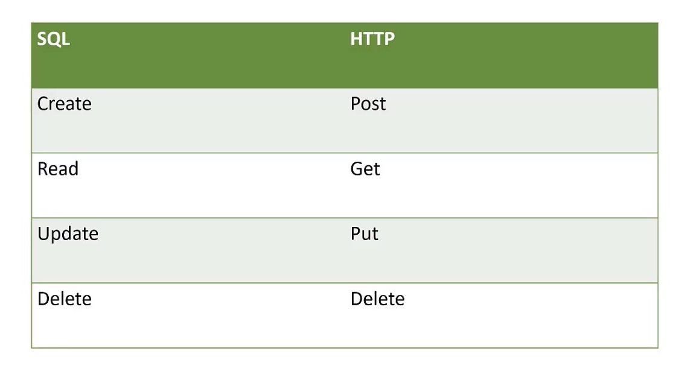

## Model - View - Controller (MVC)

`Model` is responsible for direct connect to database. Get or Put data from database when `Controller` ask.

`View` contain HTML/CSS code that dynamic receive data from database through `Controller` ( with the help of front-end framework ) - This piece of HTML/CSS is send back to `Controller` to display UI for User

`Controller` is middleman - receive `User` input and pass it to `Model` - receive respond from `Model` and pass data to `View` - receive HTML/CSS code from `View` and display it to UI

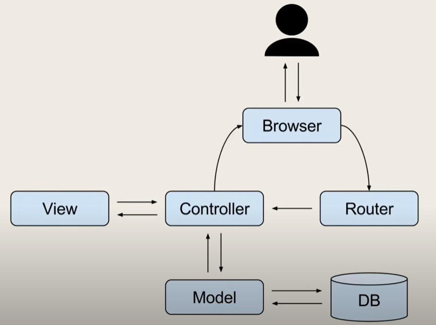

## ORM (Object relational mapper) - Entity Framework

`Object relational mapping` is a technique to convert` object-class data` to `relational database (tables)` by `Data layer`

### Code first - Database first

`Code First`: mean t  hat we write code in `Model Class` and ask `Entity Framework` to convert our code to `Databases/Tables`

## Step by step to run a .NET api with code first

Step-by-step: 
	Dotnet ef migration add 'migration name' => To create entities and table
	Dotnet ef database update => To update it to database
	Dotnet ef database drop => To drop all database
	Dotnet ef migration remove => To remove one previous migraiton
To Remove All Migration:
	Remove folder migrations in our project
	Add new migrations
Update database

# .NET 5

[Learn to build an e-commerce app with .Net Core and Angular](https://fpt-software.udemy.com/course/learn-to-build-an-e-commerce-app-with-net-core-and-angular/learn/lecture/18136742#overview)

## .NET 5 with visual studio code

First, we need to generate assets for Build and Debug .NET in VSC


- We use dotnet cli to create .net project

> dotnet new webapi

> dotnet new sln

- Add project to sln file

>dotnet sln add <project-name>

- Run .NET project

>dotnet run

- Run .NEt project and react to every changes

>dotnet watch run

## How .NET project run

### Program file

1. It will go to `program.cs` file and create `host builder`

2. All `configuration file` will be loaded into memory

### Startup class

1. `Configuration` file will be injected into `startup.cs` class

2. `ConfigureServices` method is where other services is `inject` to our project - we use `dependency injection` here

- This services will be automatically instanciate class when it needed and dispose it when it's no longer needed

3. `Configure` file is where we add `middleware` into our project

- When a request come into our API, it goes through a pipeline (HTTP pipeline) 

- What we can do is add some `middleware application` into that pipeline and manipulate our request 

4. Some `middleware`

- app.UseDeveloperExceptionPage(): for handle exception in developer mode -> give some more information about what happen

- app.UseHttpsRedirection(): if we visit page with `http` it will redirect us to `https`

- app.UseRouting(): for routing purpose

- app.UseAuthorization(): for authentication our api

- app.UseEndpoints(): for application know what endpoint - what controller are available for routing

### Launch Settings

- Contain our configuration when our api is started 

## Covention 

- Use Pascal Case for property in .NET

- Private field should start with underscore

> private readonly IConfiguration _configuration;

## Controller

Controller is the place where client request come to first

Thank to [ApiController] attribue - respective method will be call base on the request url

## Dependency

- We inject our `DbContext` to the `constructor` of `controller`.

- When the request come to the `controller` end point -> It will create `new intances` of all `dependency` that we inject to this `controller`

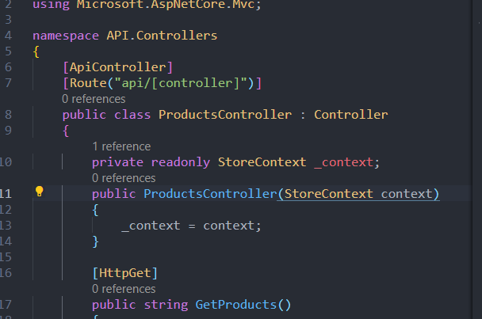

## Lifetime of dependency:

- AddScoped: the dependence will be created and available for the lifetime of single HTTP request -> most use

> And once the request is finished, then the store context is disposed and it's released from memory.

- AddTransient: the dependence will be created and available for the lifetime of individual method -> shorter lifetime than AddScoped

- AddSingleton: the dependence will be created and available when the appliication start and never destroyed until application shutdown

# Entity Framework

- Entity framework is a convention based

> If we name property include Id -> It will set this property is the primary key of table

- Create our table base on entity model

> dotnet ef migrations add <Message>

=> It will create `migration` file contain:

	- Up method -> it will create our table -> create field for that table

	- Down method -> when we add another `migration` -> it will called and drop the existing migration

- Create our `database`

> dotnet ef database update

# Relationship Convention in Entity Framework

Entity Framework is conventional base so the relationship is setting by conventional

## One to One


## One to Manny

In one - many relationship in entity framework => There is a convention of Entity Framework to allow us specify functionality when we delete one row => all relationship with that row will be delete to

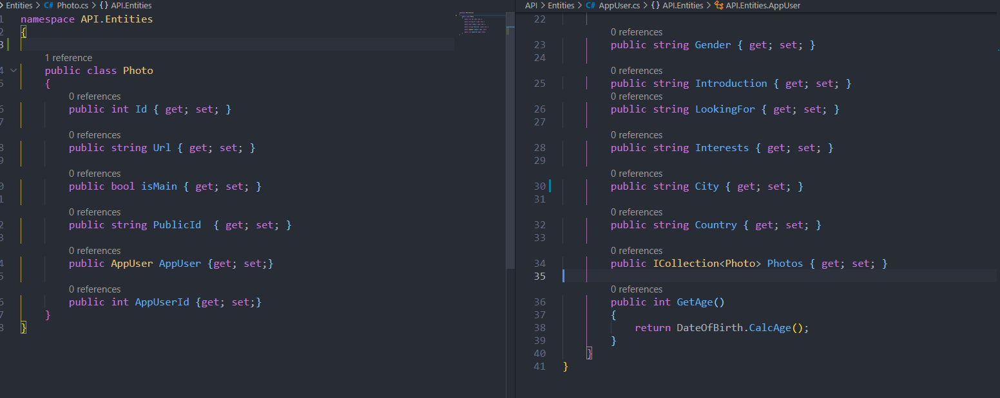

## What is ViewModal?

It is a class describe what will be sent from the client through our API

# Configure The Migrations

We can configure the column will created by EntityFramework => so we overide default configuration of entityframework

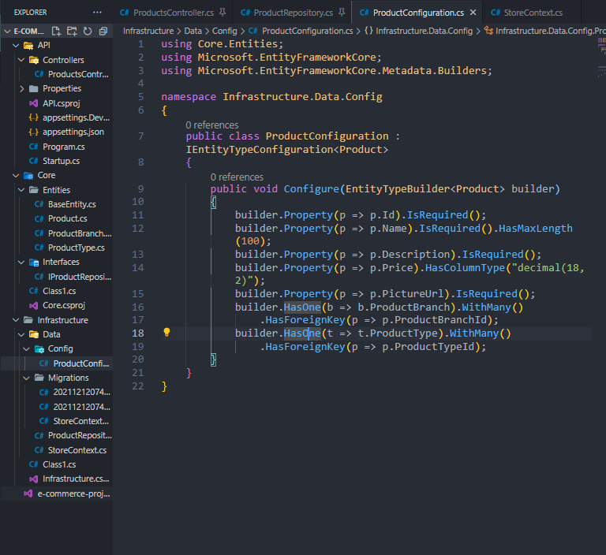

We need to overide default configuration

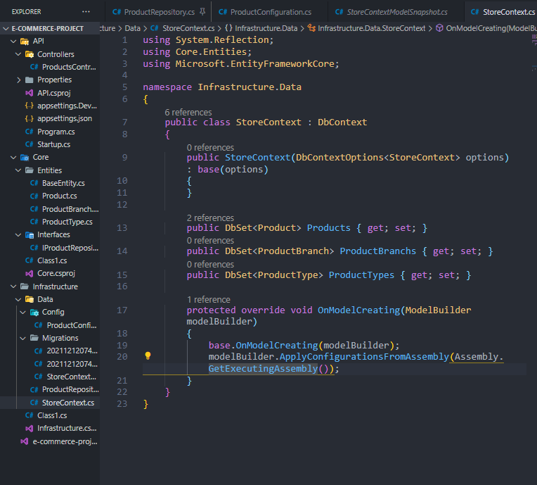

# Apply migrations when application start

Apply migrations to context and create database if it not exist 

> Best practice that microsoft recommend to do

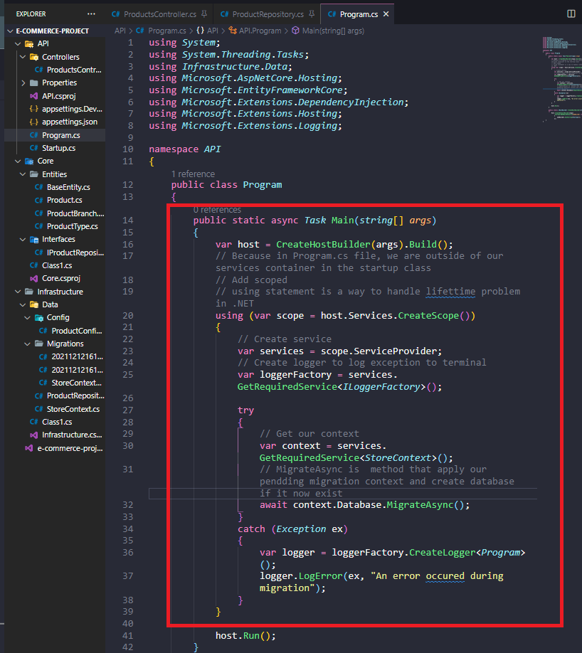

# Seeding data

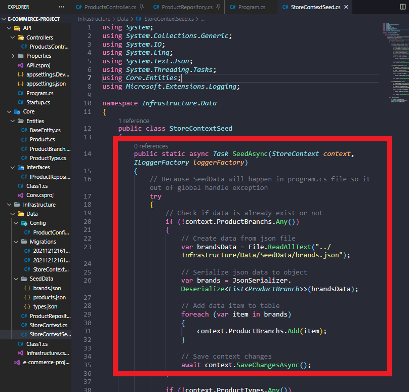

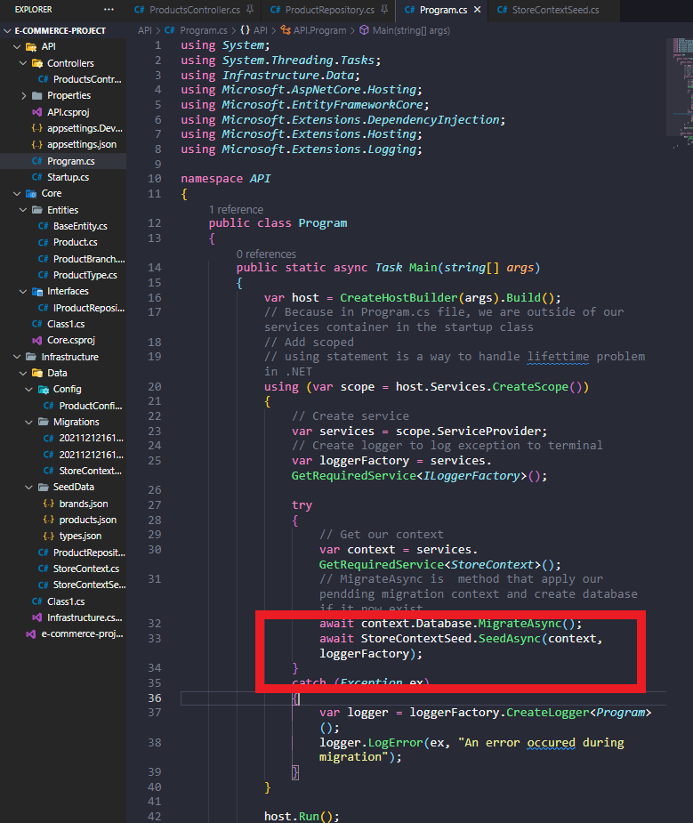

# Eager loading of navigation property 

Eager loading is a way we tell `Entity framework` to load this navigation property along with return entity

We use `Include` method to tell `Entity Framework` include what we want to include 

## DTOs

Data Transfer object - it is what we return to client

=> We use DTOs to shape the data to what we want to return

# AutoMapper

AutoMapper is a conventional-based tool help us automatically map data from one type to another type 

Create Mapping Profile with configuration

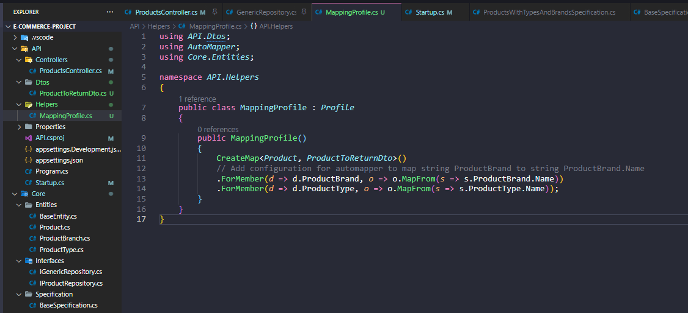

Add AutoMapper as a Service so that we can inject it in a controller

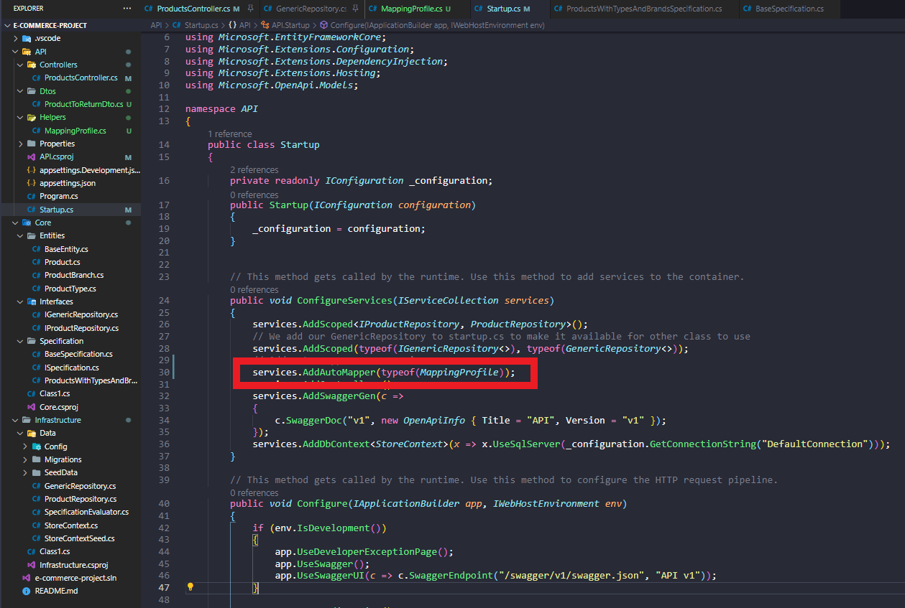

Use Map method to map data from one to one

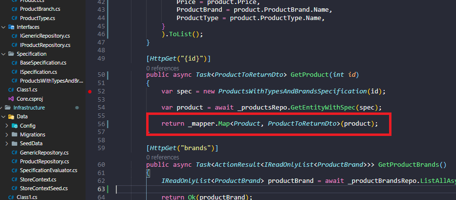

# Error Handling

## Why we need Exception Handling?

Because we want our exception response to client be consistent

=> Make client side easier to consume and handle error response.

## How manny type of exception in HTTP?

Notfound

```

    [HttpGet("notfound")]
    public ActionResult GetNotFoundRequest()
    {
       var thing = _context.Products.Find(42);
       if (thing == null) return NotFound(new ApiResponse(404));
       return Ok();
    }
```
Internal Server 

```
    [HttpGet("servererror")]
    public ActionResult GetServerError()
    {
       var thing = _context.Products.Find(42);
       var thingToReturn = thing.ToString();
       return Ok();
    }
```
Badrequest

```
    [HttpGet("badrequest")]
    public ActionResult GetBadRequest()
    {
       return BadRequest(new ApiResponse(400));
    }
```
Validation Exception

```
    [HttpGet("badrequest/{id}")]
    public ActionResult GetNotFoundRequest(int id)
    {
       return Ok();
    }

```

> We need to make all those response in consistent response

> Exception Response and Exception Middleware come into play.

## For handle badrequest and notfound

We will use ApiResponse class for create our Api Error Response

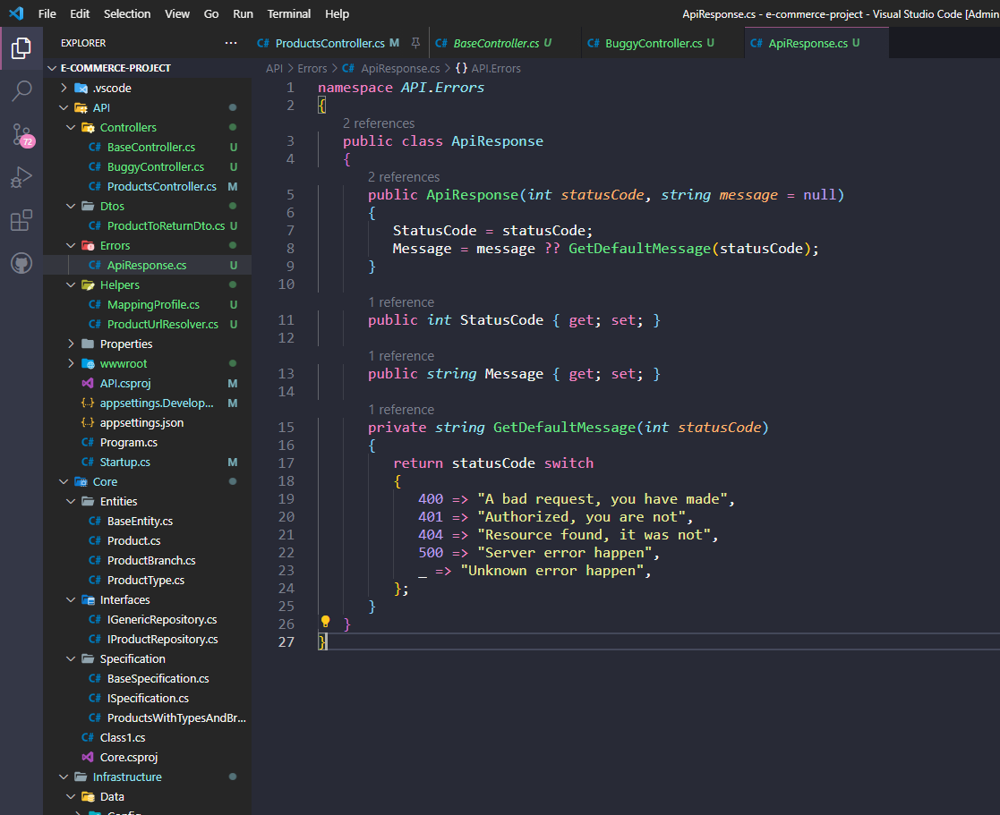

```
  	  [HttpGet("badrequest")]
      public ActionResult GetBadRequest()
      {
         return BadRequest(new ApiResponse(400));
      }
```

## For handle server exception 

First we create middleware

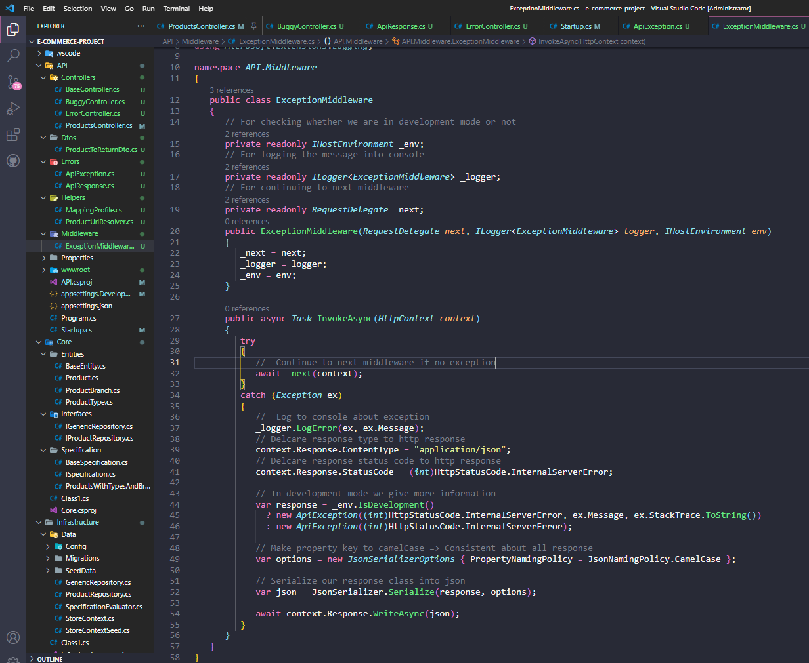

Second we add middleware into startup.cs class

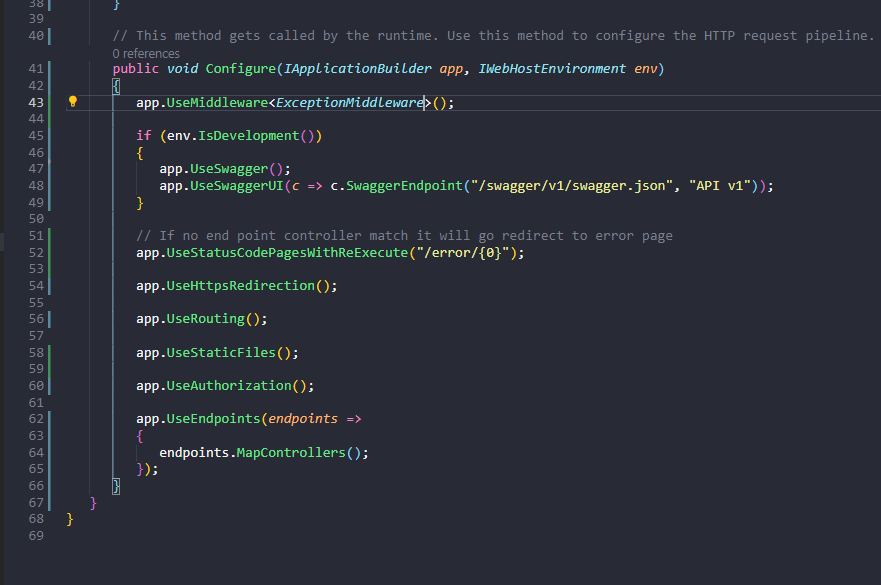

## For handle validation exception 

udemy.com/course/learn-to-build-an-e-commerce-app-with-net-core-and-angular/learn/lecture/18137228#questions

# Repository Pattern

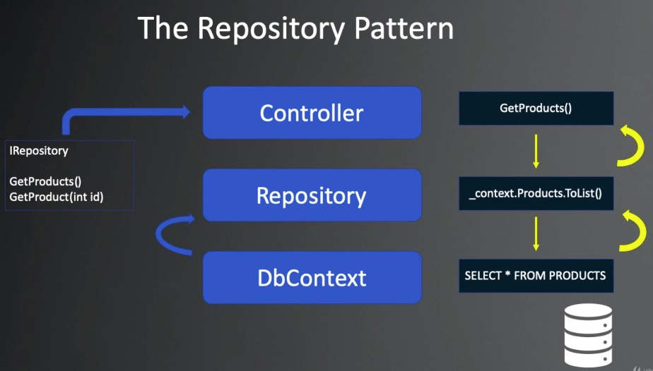

Advantages:

- Decouple business code from data acess (DbContext)

- Separation our concern

- Minimise duplicate query logic

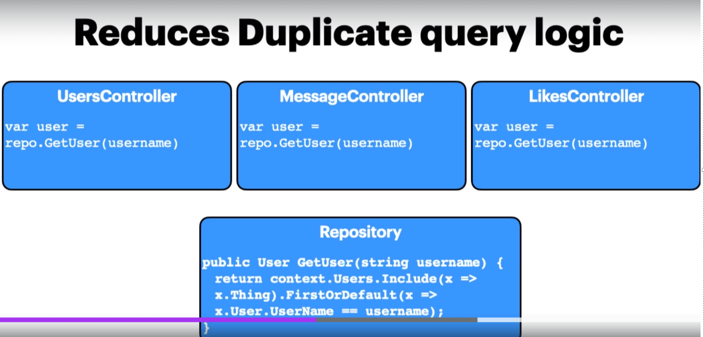

- Encapsulates the logic 

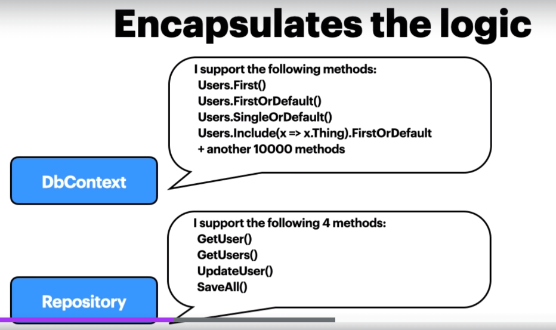

Consequences

- Increased level of abstraction

`Note`:

> We add our repository as a service to startup.cs class to make it injectable into our controllers

# Generic Repository & Specification

The idea behind create `generic repository` is that we just have `a single generic repository` that can be used for `multiple entities`

- Help avoid duplicate code

- Type safety

We already use it before 

```
DbSet<Product>
```

## IGeneric Repository

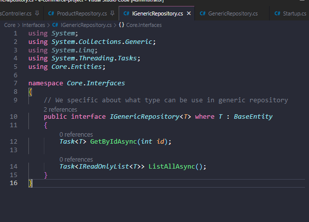

## Generic Repository

Set method:

> Set<T>()

- It create a `DbSet` with `T` entity type that can be used to query and save instances of


## Startup.cs


## Why Generic Repository is an anti pattern?

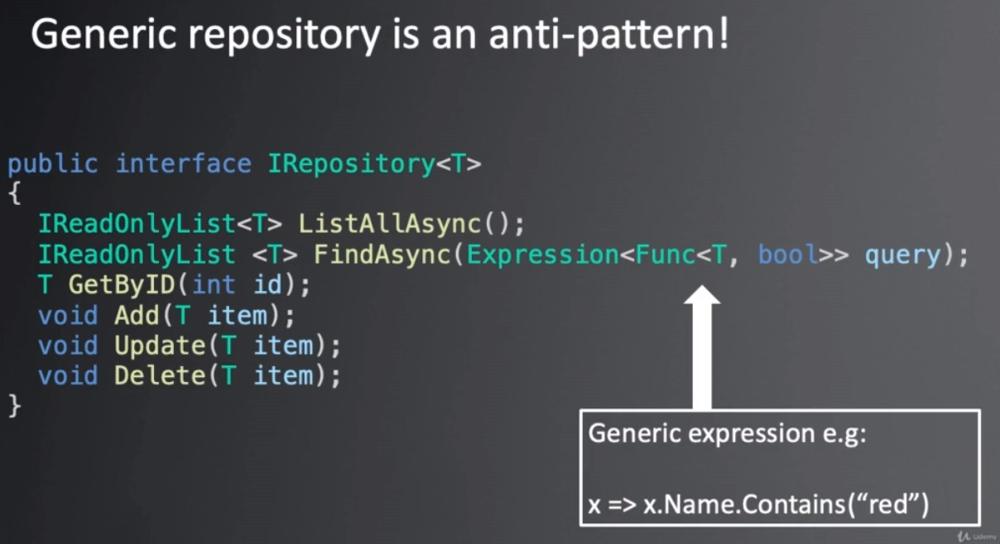

1. By return an IQueryable list of query (by using Generic Expression)

=> It expose the entire dataset through the IQueryable<T> which is what we return from that particular expression 

=> Leaky abstraction 

2. To much generalization

## Specification pattern come into rescue

1. Describle a query in an object 

> Instead of using generic expression, we could define a specificaion object which contains the query we want to send to that particular method and it return IQueryable<T> which is expression tree 

=> Generic list method would takes specification object as parameter

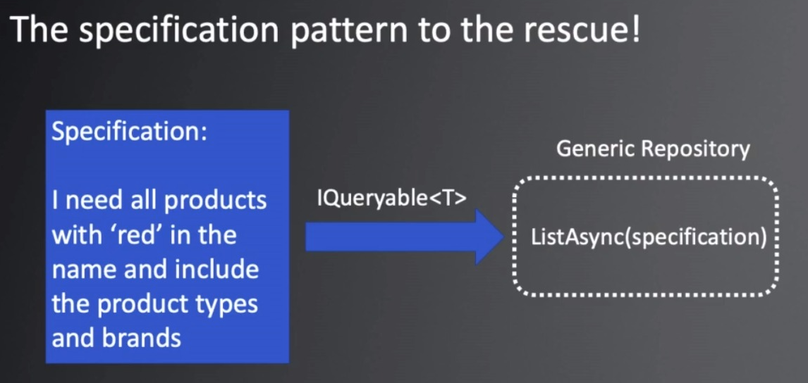

# SOLID

The term SOLID is an acronym for 5 design principles intended to make software designs more understandable, flexible and maintainable

- S: Single responsibility principle (SRP)

- O: Open closed principle (OSP)

- L: Liskov subtitution principle (LSP)

- I: Interface segregation principle (ISP)

- D: Dependency Inversion principle (DIP)

```Single responsibility principle (SRP)```

- Every module or class should have responsibility over a single part of the functionality provided by the software, and that responsibility should be entirely encapsulated by the class

> Each class and module should focus on a single task at a time
> Everything in the class should be related to that single purpose 

```Open closed principle (OSP)```

- “Software entities should be open for extension, but closed for modification”
 
- The design and writing of the code should be done in a way that new functionality should be added with minimum changes in the existing code 
 
- The design should be done in a way to allow the adding of new functionality as new classes, keeping as much as possible existing code unchanged

> Any new functionality should be implemented by adding new classes, attributes and methods, instead of changing the current ones or existing one

=> SRP and OSP are highly depend on each others

If we want to extend the functionality of method or class - we inherit it from abtracst class or interface - and we overide existing method

=> It also call polymorphism

```Lisko subtitution principle (LSP)```

- Introduced by Barbara Liskov state that “objects in a program should be replaceable with instances of their sub-types without altering the correctness of that program”

- If a program module is using a Base class, then the reference to the Base class can be replaced with a Derived class without affecting the functionality of the program module

- We can also state that Derived types must be substitutable for their base types

"S is a subtype of T, then objects of type T may be replaced with objects of type S"

Derived types must be completely substitutable for their base types

```Interface segregation principle (ISP)```

- “Many client-specific interfaces are better than one general-purpose interface”
 
- We should not enforce clients to implement interfaces that they don't use. Instead of creating one big interface we can break down it to smaller interfaces

> It because when we implement one big fat interface we force to implement all the method of that interface -> hard to extend (when we do not need one method and when we need more method) -> violate OSP and SRP

```Dependency Inversion principle (DIP)```

- High-level modules should not depend on low level modules 

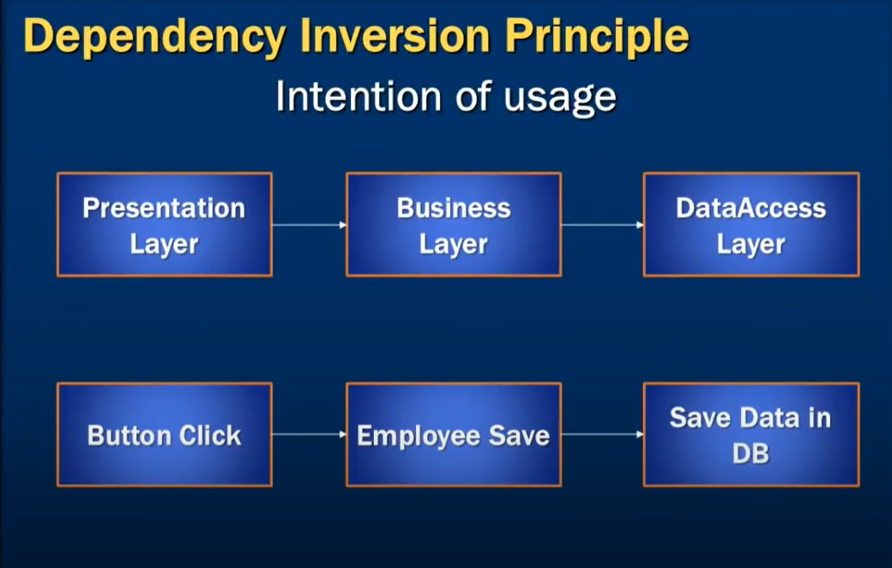


